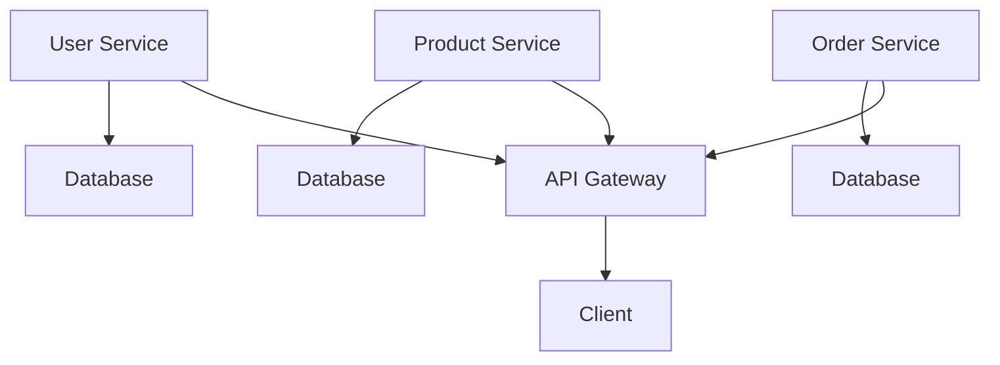

# Go Microservices Application

This project is a microservices-based application built using Go. It consists of three microservices: User Service, Product Service, and Order Service.

## Architecture

The architecture of the application is illustrated below:



## Services

- **User Service**: Manages user data and authentication.
- **Product Service**: Handles product information and inventory.
- **Order Service**: Manages order processing and status updates.

## Getting Started

### Prerequisites

- Go 1.16 or higher
- PostgreSQL

### Installation

1. Clone the repository:
   ```bash
   git clone https://github.com/ozturkeniss/GoMicro-ThreeLayered
   cd gomicro-app
   ```

2. Install dependencies:
   ```bash
   go mod download
   ```

3. Set up environment variables:
   - Create a `.env` file in the root directory and add necessary environment variables.

4. Run the services:
   ```bash
   go run user-service/main.go
   go run product-service/main.go
   go run order-service/main.go
   ```

## API Endpoints

- **User Service**:
  - `POST /api/users/register`: Register a new user
  - `POST /api/users/login`: Login a user
  - `GET /api/users/:id`: Get user details
  - `PUT /api/users/:id`: Update user details
  - `DELETE /api/users/:id`: Delete a user
  - `GET /api/users/`: List all users
  - `GET /api/health`: Health check

- **Product Service**:
  - `POST /api/products/`: Create a new product
  - `GET /api/products/:id`: Get product details
  - `PUT /api/products/:id`: Update product details
  - `DELETE /api/products/:id`: Delete a product
  - `GET /api/products/`: List all products
  - `GET /api/products/search`: Search for products
  - `PUT /api/products/:id/stock`: Update product stock
  - `GET /api/health`: Health check

- **Order Service**:
  - `POST /api/orders/`: Create a new order
  - `GET /api/orders/:id`: Get order details
  - `PUT /api/orders/:id`: Update order details
  - `DELETE /api/orders/:id`: Delete an order
  - `GET /api/orders/`: List all orders
  - `PUT /api/orders/:id/status`: Update order status
  - `GET /api/health`: Health check

## License

This project is licensed under the MIT License - see the [LICENSE](LICENSE) file for details. 
